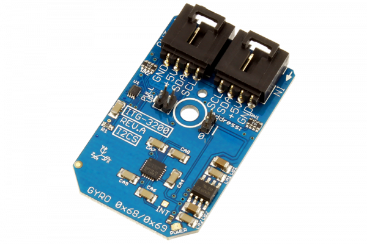

# ITG3200

This is InvenSense’s ITG-3200, a groundbreaking triple-axis, digital output MEMS gyroscope.The ITG-3200 features three 16-bit analog-to-digital converters (ADCs) for digitizing the gyro outputs, a user-selectable internal low-pass filter bandwidth, and a Fast-Mode I2C (400kHz) interface.
This Device is available from www.ncd.io 

[SKU: ITG3200_I2CS]

(https://store.ncd.io/product/itg-3200-16-bit-3-axis-mems-gyro-angular-rate-sensors-i2c-mini-module/)
This Sample code can be used with Arduino.

Hardware needed to interface ITG3200 sensor with Arduino

1. <a href="https://store.ncd.io/product/i2c-shield-for-arduino-nano/">Arduino Nano</a>

2. <a href="https://store.ncd.io/product/i2c-shield-for-arduino-micro-with-i2c-expansion-port/">Arduino Micro</a>

3. <a href="https://store.ncd.io/product/i2c-shield-for-arduino-uno/">Arduino uno</a>

4. <a href="https://store.ncd.io/product/dual-i2c-shield-for-arduino-due-with-modular-communications-interface/">Arduino Due</a>

5. <a href="https://store.ncd.io/product/itg-3200-16-bit-3-axis-mems-gyro-angular-rate-sensors-i2c-mini-module/">ITG3200 16-Bit 3-Axis MEMS Gyro Angular Sensor</a>

6. <a href="https://store.ncd.io/product/i%C2%B2c-cable/">I2C Cable</a>

ITG3200:

This is InvenSense’s ITG-3200, a groundbreaking triple-axis, digital output MEMS gyroscope.The ITG-3200 features three 16-bit analog-to-digital converters (ADCs) for digitizing the gyro outputs, a user-selectable internal low-pass filter bandwidth, and a Fast-Mode I2C (400kHz) interface.

Applications:

• Motion-enabled game controllers

• Motion-based portable gaming

• Motion-based 3D mice and 3D remote controls

• “No Touch” UI

• Health and sports monitoring

How to Use the ITG3200 Arduino Library

The ITG3200 has a number of settings, which can be configured based on user requirements.
          
1.Full-Scale Range:The following command is used to set the Full-Scale Range for the Gyro Sensor.

            itg.setFSRange(FSR_2000);                       // ±2000°/sec
            
2.Digital Low Pass Filter Configuration:The following command is used to set the Digital Low Pass Filter Configuration.

              itg.setDLPFBandwidth(DLPF_CFG_256);             // Low Pass Filter Bandwidth: 256 Hz, Internal Sample Rate: 8 kHz
              
3.Logic Level for INT Output Pin:The following command is used to set the Logic Level for INT Output Pin LOW.          
              
              itg.setINTLogic(INT_LOGIC_LOW);                 // Logic level for INT Output Pin: Active Low
              
4.Drive Type for INT Output Pin:The following command is used to set the Drive Type for INT Output Pin as Open Drain.            
              
              itg.setINTDrive(DRIVE_LOGIC_OPEN);              // Drive Type for INT Output Pin: Open Drain
              
5.Latch mode:The following command is used to configure the Latch mode as Latch untill Interrupt is cleared.            
              
              itg.setLatchMode(LATCH_MODE_LATCH);             // Latch until Interrupt is Cleared
              
6.Latch clear:The following command is used to clear the read register.

              itg.setLatchClear(LATCH_CLEAR_ANY);             // Latch Clear Method: Any Register Read
                 
7.Interrupt Status:The following command is used to Disable Interrupt when Device is Ready.                
                 
              itg.setINTDevice(INTERRUPT_DEVICE_DISABLE);     // Disable Interrupt when Device is Ready (PLL Ready after changing Clock Source)
                 
8.Interrupt data:The following command is used to Disable Interrupt when Data is Ready.
                    
              itg.setINTData(INTERRUPT_DATA_DISABLE);         // Disable Interrupt when Data is Ready
              
9.PLL setting:The following command is used to set PLL as NOt READY. 
                 
              itg.setPLLReady(PLL_NOT_READY);                 // PLL Not Ready
                 
10.Raw data Setting:The following command is used to set the Raw data as NOT READY.
                 
              itg.setRawDataReady(RAW_DATA_NOT_READY);        // Raw Data Not Ready
              
11.Device reset:The following command is used to Disable Reset Device and Internal Registers to the Power-Up-Default Settings.
                   
              itg.setDeviceReset(DEVICE_RESET_DISABLE);       // Disable Reset Device and Internal Registers to the Power-Up-Default Settings
                   
12.Sleep mode:The following command is used to Disable Low Power Sleep Mode.
                   
              itg.setSleepMode(SLEEP_MODE_DISABLE);           // Disable Low Power Sleep Mode
                  
13.Output X-Axis setting:The following command is used to set Gyro X in Normal Mode.
                   
               itg.setGyroXMode(GYRO_X_NORMAL);                // Gyro X in Normal Mode
                   
14.Output X-Axis setting:The following command is used to set Gyro Y in Normal Mode.
                     
               itg.setGyroYMode(GYRO_Y_NORMAL);                // Gyro Y in Normal Mode
                     
15.Output Z-Axis setting:The following command is used to set Gyro Z in Normal Mode.
                    
                itg.setGyroZMode(GYRO_Z_NORMAL);                // Gyro Z in Normal Mode
                    
16.Clock setting:The following command is used to set the device clock source as PLL with X Gyro.
                   
                 itg.setClockSource(PLL_GYRO_X_REF);             // PLL with X Gyro Reference
